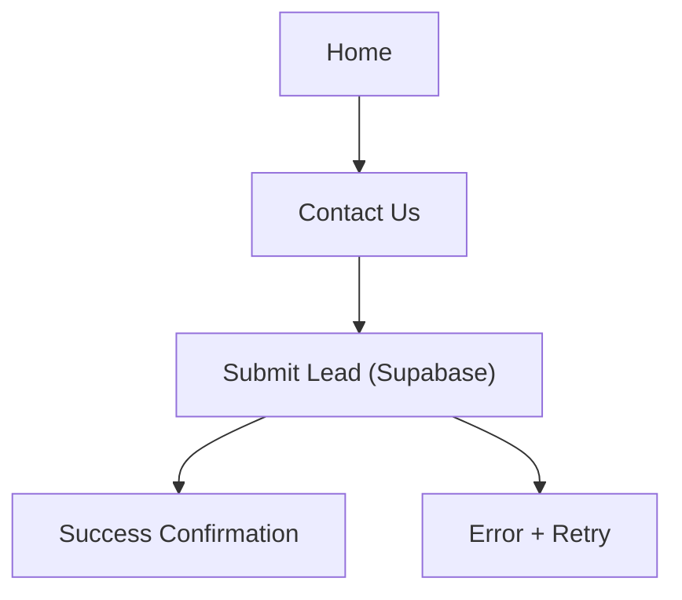

## 1. Product Overview
Revamp the existing Parcel + Tailwind marketing website with a premium, aviation-inspired aesthetic (inspired by jeskojets.com).
Add a “Contact Us” lead form that reliably captures inquiries and stores them in Supabase for follow-up.

## 2. Core Features

### 2.1 User Roles
| Role | Registration Method | Core Permissions |
|------|---------------------|------------------|
| Site Visitor | None | Browse marketing content; submit Contact Us lead form |

### 2.2 Feature Module
The revamped website consists of the following essential pages:
1. **Home**: premium hero section, marketing content sections, visual showcase, primary calls-to-action to contact.
2. **Contact Us**: lead capture form, validation + submission feedback, basic company contact information.

### 2.3 Page Details
| Page Name | Module Name | Feature description |
|-----------|-------------|---------------------|
| Home | Global navigation | Navigate between Home and Contact Us; show persistent CTA button (“Request a Quote” / “Contact”). |
| Home | Hero (premium first impression) | Present high-impact hero (image/video) with headline, short value statement, and primary CTA linking to Contact Us. |
| Home | Value proposition sections | Explain core offering in 2–4 concise sections (cards or split layout) with supporting imagery. |
| Home | Visual showcase | Display a curated image gallery/slider to reinforce premium brand feel. |
| Home | Trust + reassurance content | Communicate key reassurance points (e.g., safety-first messaging, service quality) as static content blocks. |
| Home | Footer | Provide secondary navigation, basic contact info, and legal text placeholders. |
| Contact Us | Lead form | Collect lead fields (name, email, optional phone, message); validate required fields; submit to Supabase. |
| Contact Us | Submission status | Show loading state; show success confirmation after insert; show error state with retry guidance. |
| Contact Us | Direct contact details | Display email/phone/location (as provided by your business) alongside the form. |
| Contact Us | Privacy note | Display short note explaining what information is collected and how it will be used. |

## 3. Core Process
Visitor flow:
1. You land on the Home page and scan the hero and key sections.
2. You click the primary CTA (“Contact” / “Request a Quote”) and go to Contact Us.
3. You fill in the form and submit.
4. The site validates inputs, sends the submission to Supabase, and shows a success confirmation (or an error message if submission fails).

