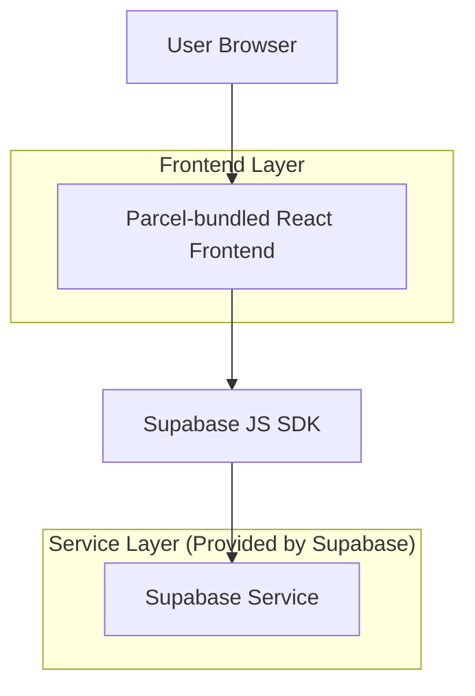
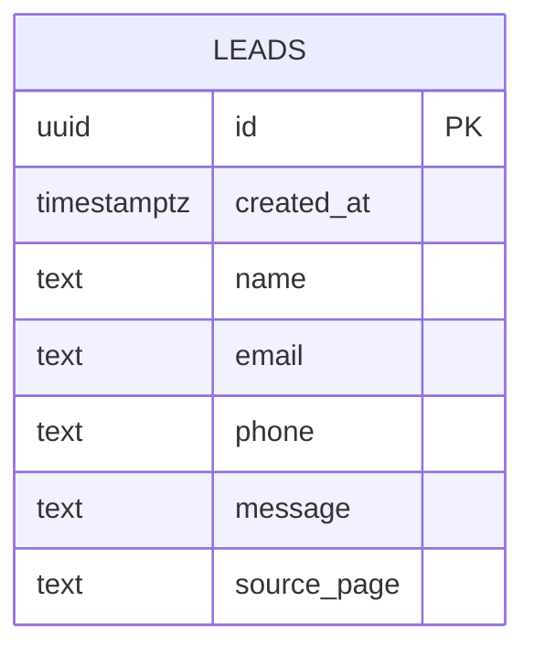

## 1.Architecture design


## 2.Technology Description
- Frontend: React@18 + parcel + tailwindcss@3
- Backend: Supabase (PostgreSQL + Auth optional)

## 3.Route definitions
| Route | Purpose |
|-------|---------|
| / | Home page, premium marketing content + CTA to Contact Us |
| /contact | Contact Us page, lead form submission stored in Supabase |

## 6.Data model(if applicable)

### 6.1 Data model definition


### 6.2 Data Definition Language
Leads Table (leads)
```sql
-- create table
CREATE TABLE IF NOT EXISTS leads (
  id UUID PRIMARY KEY DEFAULT gen_random_uuid(),
  created_at TIMESTAMP WITH TIME ZONE NOT NULL DEFAULT NOW(),
  name TEXT NOT NULL,
  email TEXT NOT NULL,
  phone TEXT NULL,
  message TEXT NOT NULL,
  source_page TEXT NULL
);

-- indexes
CREATE INDEX IF NOT EXISTS idx_leads_created_at ON leads(created_at DESC);
CREATE INDEX IF NOT EXISTS idx_leads_email ON leads(email);

-- security: enable RLS
ALTER TABLE leads ENABLE ROW LEVEL SECURITY;

-- policy: allow public (anon) inserts only (no public reads)
DROP POLICY IF EXISTS "Public can insert leads" ON leads;
CREATE POLICY "Public can insert leads"
ON leads
FOR INSERT
TO anon
WITH CHECK (true);

-- optional: allow authenticated users to manage leads (future internal tooling)
DROP POLICY IF EXISTS "Authenticated can read leads" ON leads;
CREATE POLICY "Authenticated can read leads"
ON leads
FOR SELECT
TO authenticated
USING (true);

DROP POLICY IF EXISTS "Authenticated can update leads" ON leads;
CREATE POLICY "Authenticated can update leads"
ON leads
FOR UPDATE
TO authenticated
USING (true)
WITH CHECK (true);

-- grants (keep leads private; only allow what is required)
GRANT INSERT ON leads TO anon;
GRANT ALL PRIVILEGES ON leads TO authenticated;
```

Supabase client usage (frontend)
- Store Supabase URL + anon key in environment variables exposed to the frontend build.
- Insert lead submissions from `/contact` directly using the Supabase JS SDK.
- Do not query `leads` from the public site UI (avoid exposing customer inquiries).